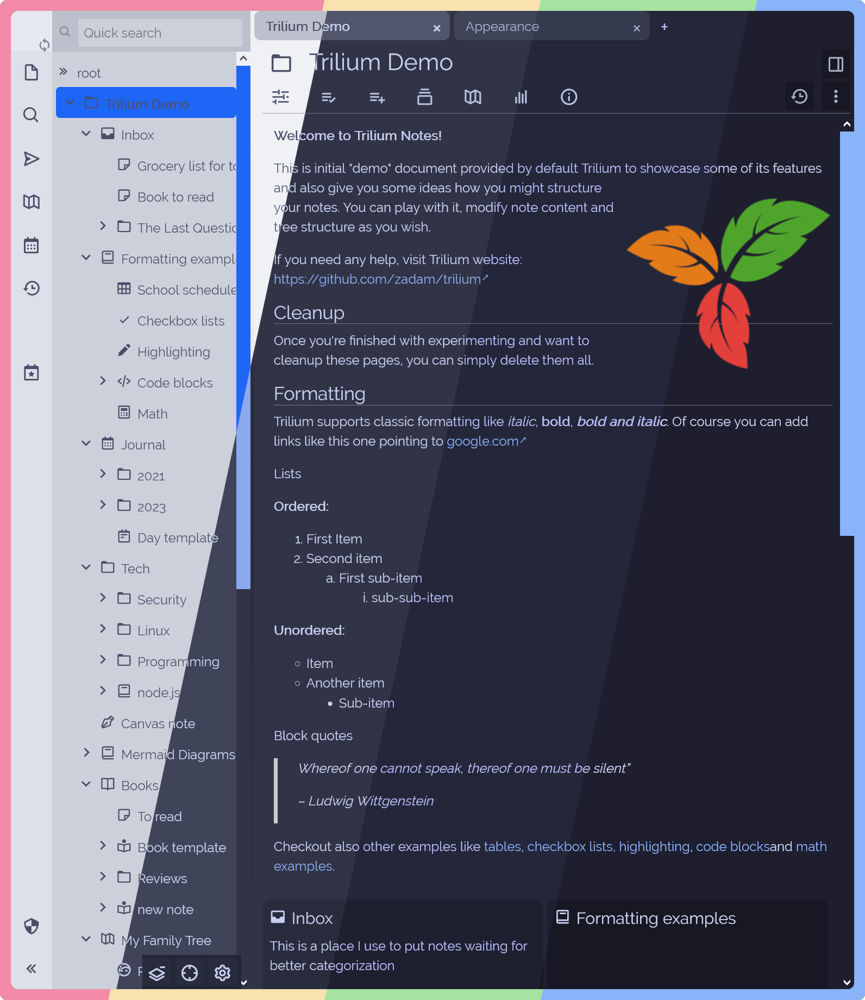
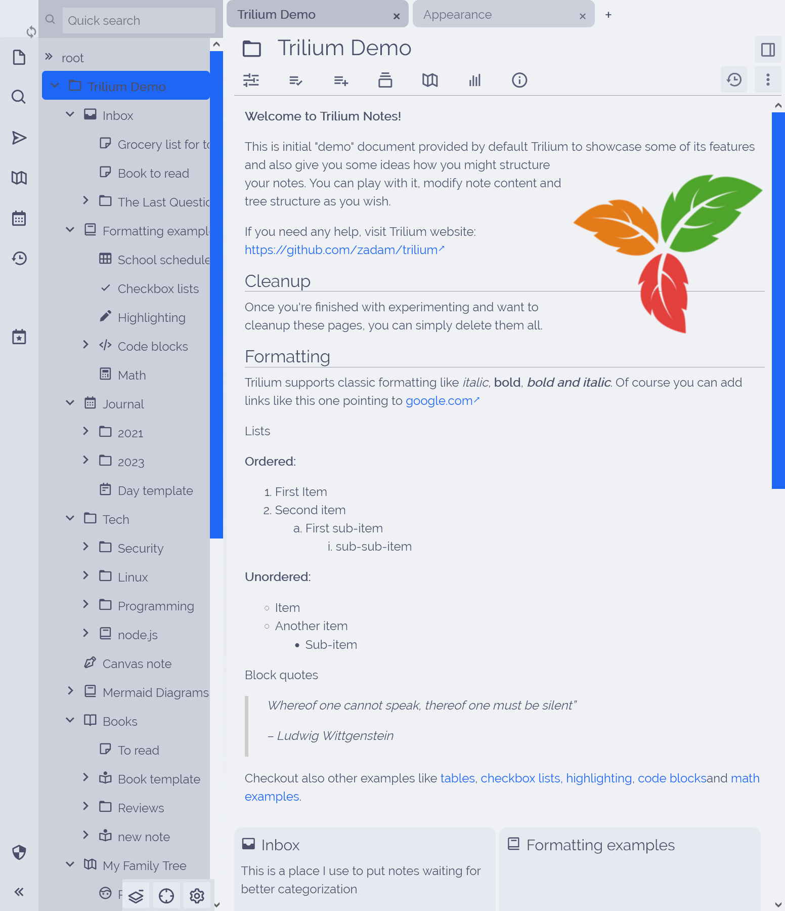
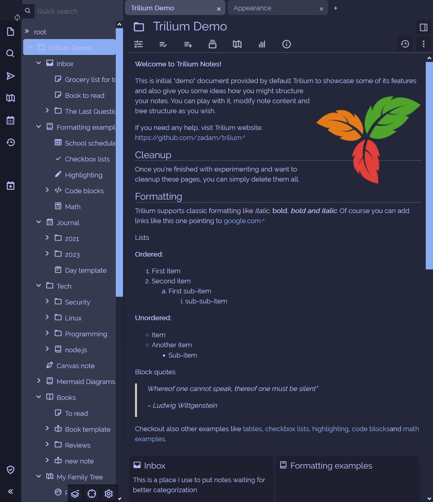
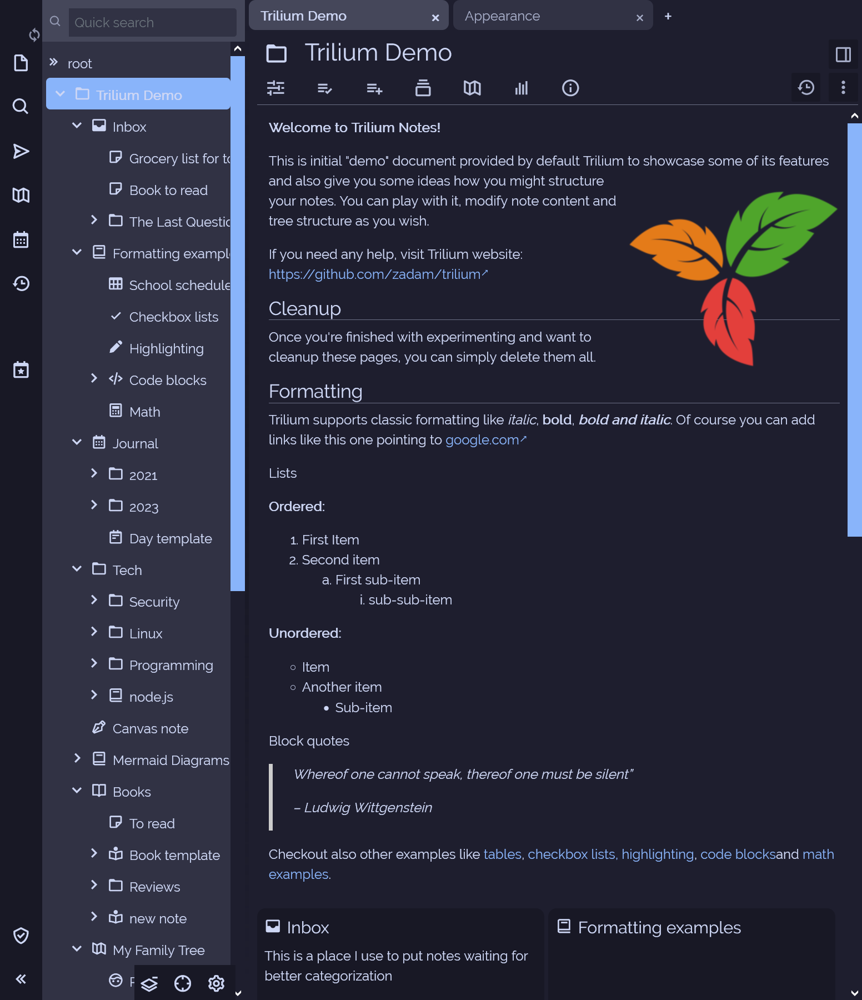

<h3 align="center">
	 
	
	Catppuccin for <a href="https://github.com/zadam/trilium">Trilium Notes</a>
	
</h3>

	
	
	

	

## Previews

🌻 Latte

🪴 Frappé

🌺 Macchiato

🌿 Mocha

## Usage

1. Download the CSS Files from the [src](/src/) folder or from the release
2. Create a new **CSS** Document inside Trilium
3. Make sure you really set the file type to `CSS`
4. Go to `Settings` → `Appearance` and select the theme of your choice

<!-- this section is optional -->
## 🙋 FAQ

-	Q: **_"Where can I change the accent colour?"_**\
	A: You can change the color in the CSS File at line 35

## 💝 Thanks to

- [justTOBBI](https://github.com/justTOBBI)

&nbsp;

	

	Copyright &copy; 2021-present <a href="https://github.com/catppuccin" target="_blank">Catppuccin Org</a>

	

